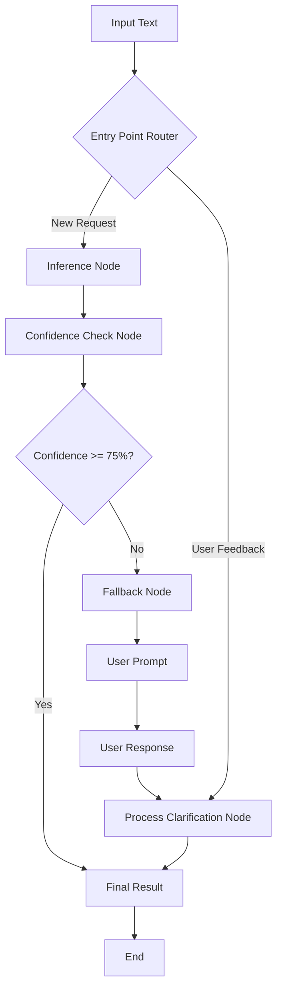

# Self-Healing Classification DAG with Fine-Tuned Model

A LangGraph-based classification pipeline that not only performs predictions but also incorporates a self-healing mechanism. It uses prediction confidence to decide whether to accept, reject, or request clarification for its outputs. 

## Features

- **Fallback System**: detects low-confidence predictions and asks for user clarification
- **Classification Optimized**: suggests the opposite label when confidence is low
- **Beautiful CLI Interface**: Rich terminal interface with progress bars, panels, and colored output
- **Comprehensive Logging**: all decisions, predictions, and user interactions are logged to JSON files
- **LangGraph Workflow**: modular, graph-based processing pipeline with clear node separation

## Workflow



## Node Descriptions

1. **Inference Node**
   - runs the fine-tuned model on input text
   - generates predictions with confidence scores
   - logs all prediction details

2. **Confidence Check Node**
   - evaluates prediction confidence against threshold
   - decides whether fallback is needed
   - routes to appropriate next step

3. **Fallback Node**
   - triggered when confidence is below threshold
   - suggests opposite label
   - prompts user with yes/no question

4. **Process Clarification Node**
   - processes user's yes/no response
   - "Yes" → uses suggested (opposite) label
   - "No" → keeps original prediction

## Installation

### Prerequisites

- Python 3.8+
- CUDA-compatible GPU (recommended for model training)
- `uv` package manager

## Installing uv
If you don't have `uv` installed, install it first:
```bash
# On macOS and Linux
curl -LsSf https://astral.sh/uv/install.sh | sh

# On Windows
powershell -c "irm https://astral.sh/uv/install.ps1 | iex"

# Alternative: Install via pip
pipx install uv
```

### Setup

1. **Clone the repository**
```bash
git clone https://github.com/aashu-0 self-healing-classifier.git
cd self-healing-classifier
```

2. **Create virtual environment**
```bash
uv venv
# activate
source .venv/bin/activate
```

3. **Install project dependencies**
```bash
uv sync
```

## Running the Project

### Using Pre-trained Model

```bash
python main.py
```

This will:
1. Load the fine-tuned model (`multiheadattn/my_awesome_model`)
2. Run a demonstration with example text
3. Start interactive mode for your own inputs

The CLI provides:
- **Beautiful interface** with colored panels and progress bars
- **Real-time feedback** during model inference
- **Confidence visualization** with progress bars
- **Smart prompting** for binary classification tasks

### Run Example

```
Text Classification with Self-Healing Fallback
Confidence Threshold: 75%

Enter text to classify: It was okay I guess.

┌─────────────────── Input Text ──────────────────┐
│ It was okay I guess.                            │
└─────────────────────────────────────────────────┘

Running inference...
Checking confidence: 68.0%

┌───────────────  Need Clarification   ───────────────┐
│     Low confidence prediction: NEGATIVE (68.0%)     │
│                                                     │
│ Was this actually a 'POSITIVE' review?              │
└─────────────────────────────────────────────────────┘

Your response (yes/no): no

┌─────────────── Classification Result ─────────────┐
│ Final Label: NEGATIVE                             │
│ Corrected via user clarification                  │
└───────────────────────────────────────────────────┘
```

## Logging

All interactions are logged to `logs/classification_log.jsonl` with structured JSON entries:


## Workflow

The system follows this workflow:

```
Input Text
    ↓
[Inference Node]
    ↓
[Confidence Check]
    ↓
Confidence >= 75%? ──Yes──→ [Final Result]
    ↓ No
[Fallback Node]
    ↓
User: yes/no
    ↓
[Process Clarification]
    ↓
[Final Result]
```

## Example reviews for testing the model
```
The acting is terrible but somehow that makes it more entertaining.

Great cinematography, shame there's no actual story to film.

I loved hating every minute of this disaster.

My kids adored it. I wanted to leave halfway through.

Technically brilliant but emotionally vacant masterpiece.

So bad it's almost good. Almost.

Beautiful failure that somehow works despite itself.

Outstanding performances in service of absolutely nothing.

This movie tried so hard to be profound. Bless its heart.

The plot was thin but the visuals were stunning.
```

## Links

- **Fine-tuned Model**: [multiheadattn/my_awesome_model](https://huggingface.co/multiheadattn/my_awesome_model)
- - **Walkthrough video**: [watch](https://www.loom.com/share/b6d6585d11d54ca6999117c40a7738e8?sid=8d66113b-250f-4cb8-b7fa-4f2a442cb655)
---
